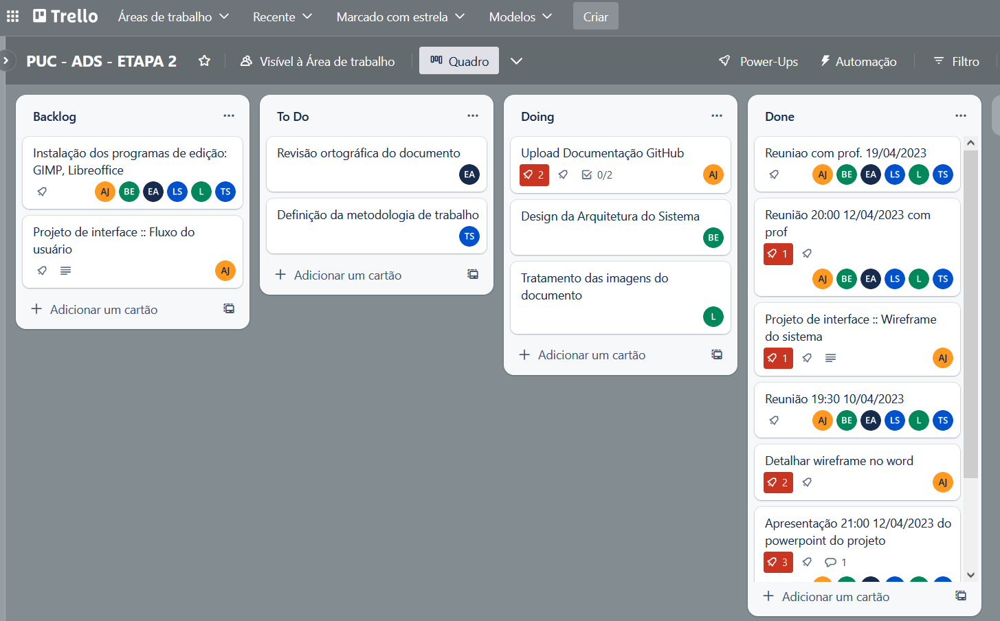

# 3. Metodologia

Definimos que a metodologia SCRUM, que é uma abordagem ágil de desenvolvimento de software que se concentra em fornecer valor de negócio de forma iterativa e incremental. É a melhor e mais viável, para nos auxiliar no nosso projeto, pois é focado nos membros da equipe e torna os processos mais simples e claros, já que  mantém os registros visíveis sobre o andamento de todas as etapas.
A metodologia contempla as definições de ferramental utilizado pela equipe tanto para a manutenção dos códigos e demais artefatos quanto para a organização do time na execução das tarefas do projeto.

## Relação de Ambientes de Trabalho

Os artefatos do projeto são desenvolvidos a partir de diversas plataformas e a relação dos ambientes com seu respectivo propósito é apresentada na tabela que se segue.

| Ambiente | Plataforma | Link de Acesso |
| --- | --- | --- |
| Repositório de Código Fonte | GitHub | https://github.com/ICEI-PUC-Minas-PMV-ADS/PMV-ADS-2023-1-E1-PROJ-WEB-T14-G5-Cadastro_De_Pessoas |
| Projeto de Interface  | MarvelApp | https://marvelapp.com/project/6683449 |
| Gerenciamento de projeto | Trello | https://trello.com/b/VceWxvyp/puc-ads-etapa-2 |

## Gerenciamento do Projeto

A equipe utiliza metodologias ágeis, tendo escolhido o Scrum como base para definição do processo de desenvolvimento.

A equipe está organizada da seguinte maneira:
* Scrum Master: Leonardo Ferreira dos Santos
* Product Owner: Andrey Bibiano Jardim
* Equipe de Desenvolvimento
    * Leonardo dos Santos
    * Evellyn Andrade Alves da Silva
    * Thiago Muniz Severino dos Santos
* Equipe de Design
    * Bárbara Gabriela Evangelista Paixão

Para organização e distribuição das tarefas do projeto, a equipe está utilizando algumas ferramentas com objetivo de realizar o gerenciamento de tarefas, tais como: GitHub e Trello estruturado com as seguintes listas: 

* <strong> Backlog </strong>: recebe as tarefas a serem trabalhadas e representa o Product Backlog. Todas as atividades identificadas no decorrer do projeto também devem ser incorporadas a esta lista.
* <strong> To Do </strong>: Esta lista representa o Sprint Backlog. Este é o Sprint atual que estamos trabalhando.
* <strong> Doing </strong>: Quando uma tarefa tiver sido iniciada, ela é movida para cá.
* <strong> Done </strong>: nesta lista são colocadas as tarefas que passaram pelos testes e controle de qualidade e estão prontos para serem entregues ao usuário. Não há mais edições ou revisões necessárias, ele está agendado e pronto para a ação.

O quadro kanban do grupo desenvolvido na ferramenta de gerenciamento de projetos está disponível através da URL do sistema Trello e é apresentado, no estado atual, na Figura X. 

 
Figura 1: Quadro Kanban / Trello em 17/04/2023

