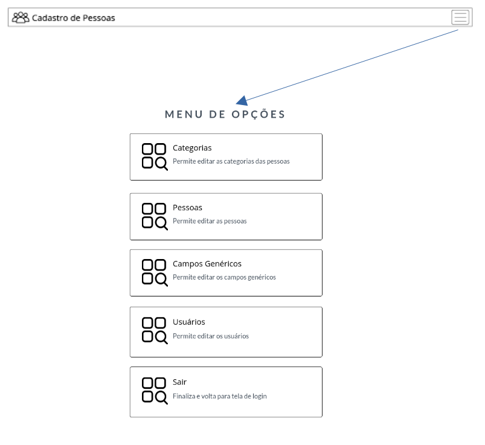

# 4. Projeto de Interface
Dentre as preocupações para a montagem da interface do sistema, estamos focados em questões como agilidade, acessibilidade e usabilidade. Desta forma, o projeto tem uma identidade visual padronizada em todas as telas que são projetadas para funcionamento em desktops e dispositivos móveis.

## 4.1 Fluxo do Usuário
Os diagramas apresentados abaixo mostram os vários fluxos do sistema. Cada uma das telas deste fluxo é detalhada na seção de Wireframes a seguir. Para visualizar o wireframe interativo, acesse o ambiente MarvelApp do projeto no endereço https://marvelapp.com/prototype/6ad1204/screen/91220260.

### 4.1.1 Fluxo Inicial
O fluxo inicial consiste na autenticação (entrada) do sistema, juntamente com a opção de recuperação de senha.

 
Figura 2 – Fluxo 1

### 4.1.2 Menu Sanduíche
O menu de opções, conhecido no mundo do design como "menu sanduíche", estará presente em todas as telas autenticadas, e dará acesso à tela de opções. Esta é a forma de navegar entre as diferentes áreas no sistema.
   

 
Figura 4 – Fluxo do menu Sanduíche

 
 ### 4.1.3 Fluxo de Opções
O fluxo de opções representa, a partir da tela de opções, o acesso às 4 áreas do sistema: Cadastro de Usuários, Categorias, Pessoas e Campos Genéricos.
   

 
Figura 3 – Fluxo do menu de opções

  
   
### 4.1.4 Hierarquia de cadastro
Cada uma das 4 áreas possui seus campos de informações distintos. Entretanto a diagramação das telas foi produzida para que seja padrão, de forma que qualquer tela de busca, cadastro ou edição seja igual, diminuindo a sobrecarga cognitiva.

#### A tela de listagem
A tela de listagem apresenta o menu sanduíche por onde se acessa o menu de opções. Apresenta também o ícone "Adicionar" para inserir um novo registro e um ícone "Editar" para cada registro apresentado.

#### A tela de Inserção
A tela de inserção apresenta o menu sanduíche por onde se acessa o menu de opções. Apresenta também o ícone "Salvar" para salvar os dados informados no banco de dados, um ícone "Voltar para listagem" para voltar para a tela de busca.

### A tela de edição
A tela de edição apresenta o menu sanduíche por onde se acessa o menu de opções. Apresenta também o ícone "Voltar para listagem", um ícone "Salvar" para salvar os dados editados e um botão "Excluir" para apagar o registro do banco de dados.

 
Figura 5 – Fluxo dos cadastros de cada área apresentando todas as telas padrões

## 4.2 Wireframes
Conforme os fluxos de telas do projeto, apresentado no item anterior, as telas do sistema são apresentadas em detalhes...

* Cabeçalho - Local onde ficam o logotipo do sistema e menu de acessibilidade (menu sanduíche);
* Conteúdo - Apresenta o conteúdo da tela acessada

 
Figura 6 – Estrutura padrão do sistema

### 4.2.1 Tela – Inicial

A tela inicial é a tela de autenticação, que consiste no cabeçalho padrão (sem o menu sanduíche), e no contenedor de conteúdo contendo os seguintes elementos:

* Título “ENTRAR NO SISTEMA”;
* Campo para informar o CPF;
* Campo para informar a senha de acesso;
* Botão para entrar;
* Link para recuperação de senha.

Ao se preencher os campos CPF e Senha, e clicando o botão “Entrar”, o sistema irá, caso seja inserido as credenciais corretas de um usuário, realizar a autenticação e entrar no sistema.

Caso o atalho “Esqueci minha Senha” seja acionada, o sistema irá ser redirecionado para a tela de recuperação de senha.

 
Figura 7 – Tela Inicial

#### 4.2.2 Tela – Recuperação de Senha

A tela de recuperação de senha consiste no cabeçalho padrão (sem o menu sanduíche), e no contenedor de conteúdo contendo os seguintes elementos:

* Título “RECUPERAÇÃO DE SENHA”;
* Campo para preenchimento do CPF da conta a ser recuperada;
* Botão “Recuperar Senha”;
* Atalho “Voltar”.

Ao se preencher o campo com o CPF da conta a ter sua senha recuperada, caso o CPF esteja corretamente cadastrado no cadastro de usuários, o sistema irá enviar um link para recuperação da senha.

Caso seja clicado no atalho “Voltar”, o sistema retornará para a tela inicial de autenticação.

 
Figura 8 – Tela Recuperacao de Senha

   

### 4.2.3 Tela – Menu de Opções

A tela de menu de opções apresentará o cabeçalho sem o menu sanduíche (que aponta para este mesma tela), juntamente com os seguintes elementos:

* Título “MENU DE OPÇÕES”;
* Botão “Categorias”;
* Botão “Pessoas”;
* Botão “Campos Genéricos”;
* Botão “Usuários”
* Botão “Sair”.

Clicando-se no botão “Categorias”, o sistema será redirecionado para a listagem de categorias. O mesmo comportamento se repete nos botões “Pessoas”, “Campos genéricos”, “Usuários”. A única exceção é o botão “Sair”, que finaliza a sessão e o sistema retorna para a tela de autenticação.

 
Figura 9 - Tela de opções

### 4.2.4 Cadastro de Pessoas
O cadastro de pessoas é composto nas ferramentas de listagem e busca, inserção, edição e exclusão dos registros.

#### 4.2.4.1 Tela - Listagem de pessoas

A tela de listagem de pessoas consiste no cabeçalho padrão contendo o menu sanduíche. Este menu irá aparecer em todas as telas, exceto nas telas de recuperação de senha e tela de entrada do sistema. Esta tela apresenta os seguintes elementos:
* Cabeçalho com o menu sanduíche
* Título “PESSOAS :: LISTAGEM”
* Campo de texto para busca de informações
* Uma grade com as informaçõe conforme a busca realizada.
* Botão “Adicionar”.

Cada linha da grade de busca irá apresentar os seguintes elementos:
* Dados da pessoa
* Botão de edição

Alterando-se o conteúdo da busca, automaticamente a grade é atualizada com os dados da busca.
Clicando-se no botão “Adicionar”, o sistema irá apresentar a tela de inserção de pessoas.
Clicando-se no menu sanduíche, o sistema irá apresentar a tela de menu.

 
Figura 10 – Tela de listagem de pessoas

#### 4.2.4.2 Tela - Inserir uma nova pessoa

A tela de edição de uma pessoa existente consiste no cabeçalho padrão contendo o menu sanduíche e os seguintes elementos:
* Título “PESSOAS :: INSERIR UMA NOVA PESSOA”;
* Grupo “Dados Principais” contendo: 
    * Código (somente leitura e será gerado automaticamente)
    * CPF/CNPJ
    * Nome / Razão Social
    * Apelido
    * Categoria

* Grupo “Contatos”
    * Telefone
    * E-mail

* Grupo “Endereço”
    * Tipo de logradouro  (Rua, Avenida, Travessa...)
    * Logradouro
    * Número
    * Complemento
    * Bairro
    * Cidade
    * Estado
    * CEP

* Grupo “Campos Genéricos” 
    * Irá apresentar os campos criados na funcionalidade “Campos Genéricos”
* Botão “Voltar para Lista”
* Botão “Salvar”.

Clicando-se no botão “Voltar para Lista”, o sistema irá ser direcionado para a listagem de pessoas já cadastradas.
Clicando-se no botão “Salvar”, o sistema irá inserir as novas informações no banco de dados e exibir a mensagem de confirmação.

 
Figura 11 - Tela de inserção de pessoas

#### 4.2.4.3 Tela - Edição de uma pessoa existente

A tela de edição de uma pessoa existente consiste no cabeçalho padrão contendo o menu sanduíche e os seguintes elementos:

* Título “PESSOAS :: EDITAR UMA PESSOA EXISTENTE”;
* Grupo “Dados Principais” contendo: 
    * Código (somente leitura)
    * CPF/CNPJ
    * Nome / Razão Social
    * Apelido
    * Categoria

* Grupo “Contatos”
    * Telefone
    * E-mail

* Grupo “Endereço”
    * Tipo de logradouro  (Rua, Avenida, Travessa...)
    * Logradouro
    * Número
    * Complemento
    * Bairro
    * Cidade
    * Estado
    * CEP

* Grupo “Campos Genéricos” 
    * Irá apresentar os campos criados na funcionalidade “Campos Genéricos”

* Botão “Voltar para Lista”
* Botão “Salvar”
* Botão “Excluir”

Clicando-se no botão “Lista”, o sistema irá voltar para a tela de listagem de pessoas.
Clicando-se no botão “Salvar”, o sistema irá salvar os dados digitados da pessoa no banco de dados e apresentar a tela de confirmação de salvamento das informações.
Clicando-se no botão “Excluir”, o sistema irá apresentar uma pergunta. Caso seja confirmada, o registro referente a esta pessoa será excluído.

Figura 12 - Tela de edição de uma pessoa já cadastrada

### 4.2.5 Categorias

#### 4.2.5.1 Tela - Listagem de Categorias

A tela de listagem de categorias consiste no cabeçalho padrão contendo o menu sanduíche além dos seguintes elementos:
* Título “CATEGORIAS :: LISTAGEM”
* Campo de texto para busca de informações
* Uma grade com as informações conforme a busca realizada.
* Botão “Adicionar”.

Ao se clicar no botão “Adicionar”, o sistema irá apresentar a tela de inserção de uma nova categoria.

 
Figura 13 – Listagem de categorias

   

#### 4.2.5.2 Tela - Inserir uma nova categoria

A tela de inserção de uma nova categoria a consiste no cabeçalho padrão contendo o menu sanduíche além dos seguintes elementos:

* Título “CATEGORIAS :: INSERIR UMA NOVA CATEGORIA”
* Grupo “Dados Principais” com os seguintes campos:
    * Código (somente leitura e será gerado automaticamente)
    * Descrição
* Botão “Voltar para lista”;
* Botão “Salvar”.

O campo código será automático e preenchido após salvar.

Ao se clicar no botão “Salvar”, o sistema irá gravar a nova categoria no banco de dados e exibir a mensagem de confirmação.

Ao se clicar no botão “Voltar para listagem”, o sistema irá voltar para a listagem de categorias sem salvar os dados preenchidos.

 
Figura 14 – Inserção de uma nova categoria

#### 4.2.5.3 Tela – Editar uma categoria existente

A tela de edição de uma categoria já existente consiste no cabeçalho padrão contendo o menu sanduíche além dos seguintes elementos:

* Título “CATEGORIAS :: EDITAR UMA CATEGORIA EXISTENTE”
* Grupo “Dados Principais” com os seguintes campos:
    * Código (somente leitura)
    * Descrição
* Botão “Voltar para lista”;
* Botão “Salvar”;
* Botão “Excluir”.

O campo código será automático e preenchido após salvar.

Ao se clicar no botão “Salvar”, o sistema irá atualizar categoria no banco de dados e exibir a mensagem de confirmação.
Ao se clicar no botão “Voltar para listagem”, o sistema irá voltar para a listagem de categorias sem salvar os dados preenchidos.
Ao se clicar no botão “Excluir”, o sistema irá, após confirmação, excluir esta categoria do banco de dados.

 
Figura 15 – Edição de uma categoria existente

### 4.2.6 Usuários
#### 4.2.6.1 Tela - Listagem de usuários

A tela de listagem de usuários consiste no cabeçalho padrão contendo o menu sanduíche além dos seguintes elementos:
* Título “USUÁRIOS :: LISTAGEM”
* Campo de texto para busca de informações
* Uma grade com as informações conforme a busca realizada.
* Botão “Adicionar”.

Ao clicar no botão “Adicionar”, o sistema irá apresentar a tela de inserção de um novo usuário.

 
Figura 16 - Tela de listagem de usuários do sistema

   

#### 4.2.6.2 Tela - Inserir um novo usuários

A tela de inserir novos usuários consiste no cabeçalho padrão contendo o menu sanduíche e os seguintes elementos:

* Título “USUÁRIO :: CRIAR UM NOVO USUÁRIO”;
* Grupo “Dados Principais” 
   * CPF
   * Nome
   * E-mail
   * Senha
   * Campo de confirmação de senha
* Botão “Voltar para Lista”
* Botão “Salvar”.

 
Figura 17 - Tela de inserção de novos usuários

#### 4.2.6.3 Tela - Editar um usuário existente

A tela de editar usuários existentes consiste no cabeçalho padrão contendo o menu sanduíche e os seguintes elementos:

* Título “USUÁRIO :: EDITAR UM USUÁRIO EXISTENTE”;
* Grupo “Dados Principais” 
   * CPF
   * Nome
   * E-mail
   * Senha
   * Campo de confirmação de senha
* Botão "Voltar para Lista"
* Botão "Salvar" 
* Botão "Excluir"

 
Figura 18 - Tela de edição de um usuário já existente

### 4.2.7 Campos genéricos

#### 4.2.7.1 Tela - Listagem de campos genéricos

A tela de listagem de campos genéricos permite listar os campos adicionais no cadastro de pessoas. 

 
Figura 19 - Tela de listagem de campos genérico

   
   
#### 4.2.7.2 Tela - Inserir um novo campo genérico

A tela de inserir um novo campo genérico consiste no cabeçalho padrão contendo o menu sanduíche e os seguintes elementos:

* Título “CADASTRO GENÉRICO :: INSERIR UM NOVO CAMPO”;
* Grupo “Dados Principais” 
   * Código (somente leitura e será gerado automaticamente)
   * Descrição
* Botão "Voltar para Lista"
* Botão "Salvar" 

 
Figura 20 - Tela de inserção de um novo campo genérico

   
#### 4.2.7.3 Tela - Editar um campo genérico existente

A tela de edição de um campo genérico consiste no cabeçalho padrão contendo o menu sanduíche e os seguintes elementos:
* Título “CADASTRO GENÉRICO :: EDITAR UM CAMPO EXISTENTE”;
* Grupo “Dados Principais” 
   * Código (somente leitura)
   * Descrição
* Botão "Voltar para Lista"
* Botão "Salvar" 
* Botão "Excluir"   
   

 
Figura 21 - Tela de edição de um campo genérico existente

   

#### 4.2.7.4 Tela - Campo genérico salvo com sucesso

 
Figura 22 - Tela campo genérico salvo com sucesso

#### 4.2.7.5 Tela - Excluir campo genérico

 
Figura 23 - Tela de confirmação de exclusão de um campo genérico

#### 4.2.7.6 Tela - campo genérico excluído com sucesso

 
Figura 24 - Tela campo genérico excluído com sucesso

