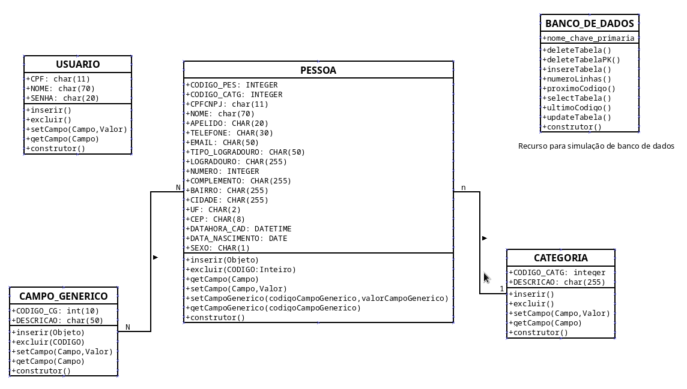

# Arquitetura da Solução

Neste tópico iremos tratar sobre a parte técnica da solução desenvolvida pela equipe, apresentando os componentes que fazem parte do sistema e do ambiente de hospedagem.

## Diagrama de componentes

Os componentes que fazem parte da solução são apresentados na Figura que se segue.

[Navegador]
 - Páginas web (html + CSS + JS)
 - Local storage
  - Pessoa
  - Categoria
  - Campo Generico
  - Pessoa tem Campo Generico Preenchido
  - Usuário
  
  => INTERNET

[Hospedagem] 
 (Locaweb)
 (Cloudflare)

Bla bla bla bla Bla bla bla bla Bla bla bla bla Bla bla bla bla 

## Diagrama de Classes

O diagrama de classes ilustra a estrutura do software e como cada uma das classes da sua estrutura estarão interligadas. Essas classes servem de modelo para materializar os objetos que persistirão em memória assim como identificar os métodos mais utilizados.

## Modelo Entidade-Relacionamento 

O Modelo Entidade-Relacionamento representa através de um diagrama como as entidades se relacionam entre si na aplicação.

## Diagrama de Tabelas

O diagrama de tabelas detalha a representação das entidades e relacionamentos identificadas no Modelo ER, no formato de tabelas, com colunas e chaves primárias/estrangeiras necessárias para representar corretamente as restrições de integridade.
 

## Tecnologias Utilizadas

Todas as imagens, leiautes e códigos-fonte foram desenvolvidos pelos integrantes do grupo.

| Tecnologia | Descrição | Extras |
| --- | --- | --- | 
| Linguagens utilizadas no desenvolvimento da solução | HTML, CSS, JavaScript | |
| IDEs de desenvolvimento | Visual Studio, Geany | https://visualstudio.com   https://geany.org | 
| Plataforma para hospedagem do sistema | VPS Locaweb | https://locaweb.com.br | 
| Plataforma para hospedagem dos arquivos | GITHUB | https://github.com | 
| Ferramenta de versionamento | Git | https://git-scm.com | 
| Ferramenta para a criação de ícones | GIMP | https://gimp.org |
| Ferramenta de acesso direto ao servidor | Filezilla | https://filezilla-project.org | 

## Hospedagem
O sistema está alocado em uma VPS da Locaweb, através de rsync deste repositório do github e também envio direto via filezilla.

