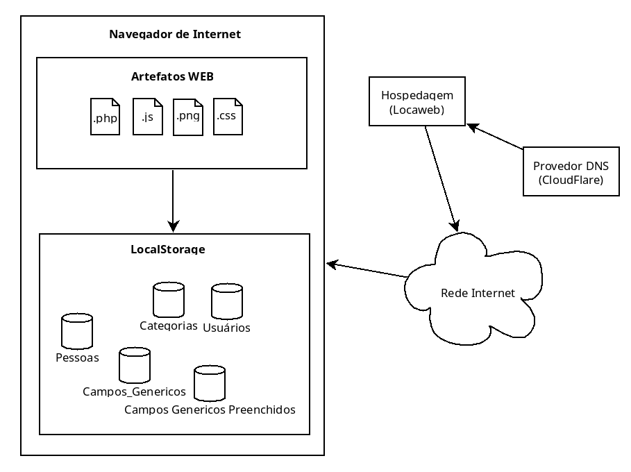

# Arquitetura da Solução

Neste tópico iremos tratar sobre a parte técnica da solução desenvolvida pela equipe, apresentando os componentes que fazem parte do sistema e do ambiente de hospedagem.

## Diagrama de componentes

Os componentes que fazem parte da solução são apresentados na representação a seguir:

 
Figura X: Arquitetura da Solução

## Diagrama de Classes

O diagrama de classes ilustra a estrutura do software e como cada uma das classes da sua estrutura estarão interligadas. Essas classes servem de modelo para materializar os objetos que persistirão em memória assim como identificar os métodos mais utilizados.

 
Figura X: Diagrama de Classes

## Tecnologias Utilizadas

Todas as imagens, leiautes e códigos-fonte foram desenvolvidos pelos integrantes do grupo.

| Tecnologia | Descrição | Extras |
| --- | --- | --- | 
| Linguagens utilizadas no desenvolvimento da solução | HTML, CSS, JavaScript, PHP | |
| IDEs de desenvolvimento | Visual Studio, Geany | https://visualstudio.com   https://geany.org | 
| Plataforma para hospedagem do sistema | VPS Locaweb | https://locaweb.com.br | 
| Plataforma para hospedagem dos arquivos | GITHUB | https://github.com | 
| Ferramenta de versionamento | Git | https://git-scm.com | 
| Ferramenta para a criação de ícones | GIMP | https://gimp.org |
| Ferramenta de acesso direto ao servidor | Filezilla | https://filezilla-project.org | 
| DNS | Cloudflare | https://cloudflare.com | 
