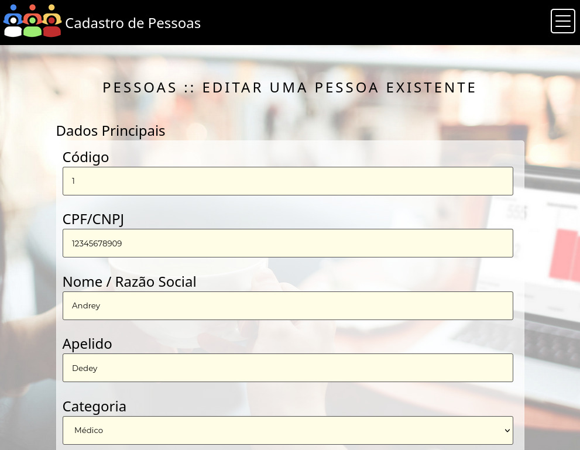

## 6. Templates e funcionalidades do sistema
Nesta seção são apresentadas as telas desenvolvidas para cada uma das funcionalidades do sistema. O endereço para acesso ao sistema é https://cp.multiaccess.com.br.

Todas as telas utilizam alguns artefatos compartilhados, abaixo descrito os artefatos comuns em forma hierárquica.

- Cabecalho.php
	- /js/jquery-3.3.1.min.js
	- /js/Funcoes.js
	- /js/Banco_De_Dados.js
	- /js/Usuario.js
	- /js/Pergunta.js
	
	- /css/Padrao.css
	- /css/Pergunta.css
	
	- /Imagens/Logotipo.jpg
	- /Imagens/Menu.jpg

### 6.1 Login
Esta é a tela inicial do sistema. Permite que os usuários possam se autenticar e entrar no sistema. Fornece também um link para recuperação de senha perdida.

 
Figura X – Tela inicial

| Requisitos atendidos | Cópia do Requisito |
| --- | --- |
| RF-04 | O sistema não poderá funcionar sem autenticação. |

Artefatos específicos:
 - index.php

### 6.2 Recuperação de senha

É a tela que permite a recuperação do login em caso de senha perdida. Como o sistema não fornece as tecnologias backend, irá editar o usuário "00000000000" com senha "123".

 
Figura X – Tela de recuperação de senha

| Requisitos atendidos | Cópia do Requisito |
| --- | --- |
| RF-05 | O sistema deverá permitir que os usuários recuperam sua senha. |

Artefatos específicos:
 - Recuperacao_Senha.php

### 6.3 Menu de Opções

Acessado a partir do menu sanduíche, permite acessar as principais áreas do sistema: Cadastro de pessoas, categorias, usuários e campos genéricos.

 
Figura X – Tela de opções

| Requisitos atendidos | Cópia do Requisito |
| --- | --- |
| RF-6 | O sistema deverá apresentar um menu que permita acesso as principais áreas do sistema. | Alta | 
 

Artefatos específicos:
 - Opcoes.php

### 6.4 Categorias :: Listagem

Permite listar a categorias já cadastradas, com opção de busca, e acesso às ferramentas de edição e inserção de uma nova categoria.

 
Figura X – Tela de listagem de categorias cadastradas

| Requisitos atendidos | Cópia do Requisito |
| --- | --- |
| RF-2 | O sistema deverá inserir categorias para serem vinculadas às pessoas, podendo uma pessoa estar vinculada a mais de uma categoria. |

Artefatos específicos:
 - Categorias_Listar.php

### 6.5 Categorias :: Inserção

Permite inserir uma nova categoria.

 
Figura X – Tela de opções

| Requisitos atendidos | Cópia do Requisito |
| --- | --- |
| RF-7 | O sistema deverá permitir inserir/editar/excluir/listar categorias. |

Artefatos específicos:
 - Categorias_Inserir.php

### 6.6 Categorias :: Edição

Permite editar uma categoria já cadastrada, com opção de exclusão.

 
Figura X – Tela de edição de categorias

| Requisitos atendidos | Cópia do Requisito |
| --- | --- |
| RF-7 | O sistema deverá permitir inserir/editar/excluir/listar categorias. | Alta | 

Artefatos específicos:
 - Categorias_Editar.php

### 6.7 Pessoas :: Listagem

Permite listar as pessoas já cadastradas, com opção de busca, e acesso às ferramentas de edição e inserção de uma nova pessoa.

[TELA_RECUPERAR_SENHA.jpg]

| Requisitos atendidos | Cópia do Requisito |
| --- | --- |
| RF-08 | O sistema deverá permitir ao usuário buscar pessoas por filtros. |

### 6.8 Pessoas :: Inserção

Permite inserir uma nova pessoa.

 
Figura X – Tela de inserção de pessoas (Parte de cima)
 
Figura X – Tela de inserção de pessoas (Parte de baixo)

| Requisitos atendidos | Cópia do Requisito |
| --- | --- |
| RF-01 | O sistema deverá cadastrar pessoas físicas ou jurídicas, contendo todos os dados como nome completo, CPF ou CNPJ, telefones e endereço. |

Artefatos específicos:
 - Pessoas_Inserir.php

### 6.9 Pessoas :: Edição

Permite editar uma pessoa já cadastrada, com opção de exclusão.

 
Figura X – Tela de edição de pessoas (Parte de cima)
 
Figura X – Tela de edição de pessoas (Parte de baixo)

| Requisitos atendidos | Cópia do Requisito |
| --- | --- |
| RF-12 |  O sistema deverá cadastrar/editar/excluir/listar usuários, e utiliza-los para autenticação. |

Artefatos específicos:
 - Pessoas_Editar.php

### 6.10 Cadastro Genérico :: Listagem

Permite listar os campos genéricos já cadastrados, com opção de busca, e acesso às ferramentas de edição e inserção de um novo campo genérico.

 
Figura X – Tela de listagem de campos genéricos

| Requisitos atendidos | Cópia do Requisito |
| --- | --- |
| RF-10 | O sistema deverá permitir criar/inserir campos adicionais no cadastro de pessoas. |

Artefatos específicos:
 - Campos_Genericos_Listar.php

### 6.11 Cadastro Genérico :: Inserção

Permite inserir um novo campo genérico.

 
Figura X – Tela de inserção de um campo genérico

| Requisitos atendidos | Cópia do Requisito |
| --- | --- |
| RF-10 | O sistema deverá permitir criar/inserir campos adicionais no cadastro de pessoas. |

Artefatos específicos:
 - Campos_Genericos_Inserir.php

### 6.12 Cadastro Genérico :: Edição

Permite editar um campo genérico já cadastrado, com opção de exclusão.

 
Figura X – Tela de edição de um campo genérico existente

| Requisitos atendidos | Cópia do Requisito |
| --- | --- |
| RF-7 | O sistema deverá permitir inserir/editar/excluir/listar categorias.  |

Artefatos específicos:
 - Campos_Genericos_Editar.php

### 6.13 Usuários :: Listagem

Permite listar os usuários já cadastrados, com opção de busca, e acesso às ferramentas de edição e inserção de uma novo usuário.

 
Figura X – Tela de listagem de usuários

| Requisitos atendidos | Cópia do Requisito |
| --- | --- |
| RF-12 | O sistema deverá cadastrar/editar/excluir/listar usuários, e utiliza-los para autenticação. |

Artefatos específicos:
 - Usuarios_Listar.php

### 6.14 Usuários :: Inserção

Permite listar os usuários já cadastrados, com opção de busca, e acesso às ferramentas de edição e inserção de uma novo usuário.

 
Figura X – Tela de inserção de um novo usuário

| Requisitos atendidos | Cópia do Requisito |
| --- | --- |
| RF-12 | O sistema deverá cadastrar/editar/excluir/listar usuários, e utiliza-los para autenticação. |

Artefatos específicos:
 - Usuarios_Inserir.php

### 6.15 Usuários :: Edição

Permite editar um usuário já cadastrado, com opção de exclusão.

 
Figura X – Tela de edição de um usuário existente

| Requisitos atendidos | Cópia do Requisito |
| --- | --- |
| RF-12 | O sistema deverá cadastrar/editar/excluir/listar usuários, e utiliza-los para autenticação. |

Artefatos específicos:
 - Usuarios_Editar.php

### 6.16 Estrutura de dados

Todas as informações são gravadas em JSON no localstorage através do objeto de persistência Banco_De_Dados, que simula uma inserção, exclusão, consulta e atualização como em um SGDB.

| Área do sistema | Exemplo em JSON|
| --- | --- | 
| Usuários / Login | [{"nome":"admin","cpf":"00000000000","senha":"123","codigo":1}] |
| Categorias | [{"nome":"Pacientes","codigo":1},{"nome":"Médicos","codigo":2}] |
| Campos Genéricos | [{"nome":"Doença","codigo":1},{"nome":"Medicamentos em Uso","codigo":2}]
| Pessoas  | [{"cpfcnpj":"12345678909","nome":"Andrey Bibiano Jardim","apelido":"Dedey","categoria":"1","telefone":"(32) 98812-9751","email":"andreyjardim@yahoo.com","tipo_logradouro":"","logradouro":"","numero":"","complemento":"","bairro":"","cidade":"","uf":false,"cep":"","codigo":1}]
| Pessoas / Campos genéricos preenchidos | [{"codigoPessoa":1,"codigoCampoGenerico":1,"valorCampoGenerico":"Autismo","codigo":3},{"codigoPessoa":1,"codigoCampoGenerico":2,"valorCampoGenerico":"Fenoxazolina","codigo":4}] |

### 6.17 Instruções de acesso ao sistema

1. Abra um navegador de Internet e informe a seguinte URL: https://cp.multiaccess.com.br
2. Caso seja seu primeiro acesso, clique em "Entrar". O sistema irá automaticamente criar um usuário 00000000000 e senha "123".
3. Preencha o campo com suas credenciais e clique em entrar.
4. Navegue no sistema através dos botões de ação da tela ativa, ou busque novas telas através do menu sanduíche, conforme diagrama constante em "4.1 Fluxo do Usuário"