## 7. Funcionalidades do sistema
Nesta seção são apresentadas as telas desenvolvidas para cada uma das funcionalidades do sistema. O endereço para acesso ao sistema é https://cp.multiaccess.com.br. Outras orientações de acesso serão apresentadas na sequência.

Todas as telas utilizam alguns artefatos compartilhados, aqui descrito os artefatos comuns em forma hierárquica.

- Cabecalho.php
	- /js/jquery-3.3.1.min.js
	- /js/Funcoes.js
	- /js/Banco_De_Dados.js
	- /js/Usuario.js
	- /js/Pergunta.js
	
	- /css/Padrao.css
	- /css/Pergunta.css
	
	- /Imagens/Logotipo.png
	- /Imagens/Menu.png

### 7.1 Login
Esta é a tela inicial do sistema. Permite que os usuários possam se autenticar e entrar no sistema. Fornece também um link para recuperação de senha perdida.

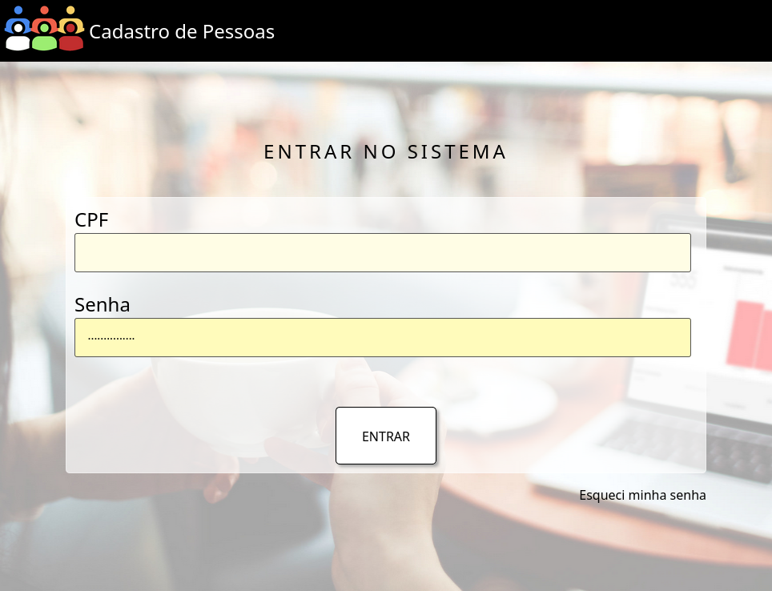 
Figura X – Tela inicial

| Requisitos atendidos | Cópia do Requisito |
| --- | --- |
| RF-01 | BLA BLA BLA |
| RF-02 | BLA BLA BLA |

Artefatos específicos:
 - index.php

### 7.2 Recuperação de senha

É a tela que permite a recuperação do login em caso de senha perdida. Como o sistema não fornece as tecnologias backend, irá inserir ou editar um usuário "admin" com senha "admin".

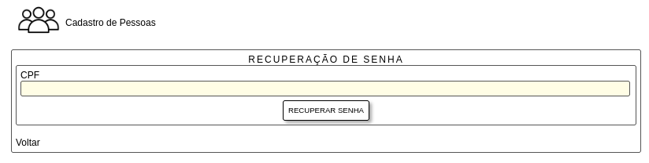 
Figura X – Tela de recuperação de senha

| Requisitos atendidos | Cópia do Requisito |
| --- | --- |
| RF-01 | BLA BLA BLA |
| RF-02 | BLA BLA BLA |

Artefatos específicos:
 - Recuperacao_Senha.php

### 7.3 Menu de Opções

Acessado a partir do menu sanduíche, permite acessar as principais áreas do sistema: Cadastro de pessoas, categorias, usuários e campos genéricos.

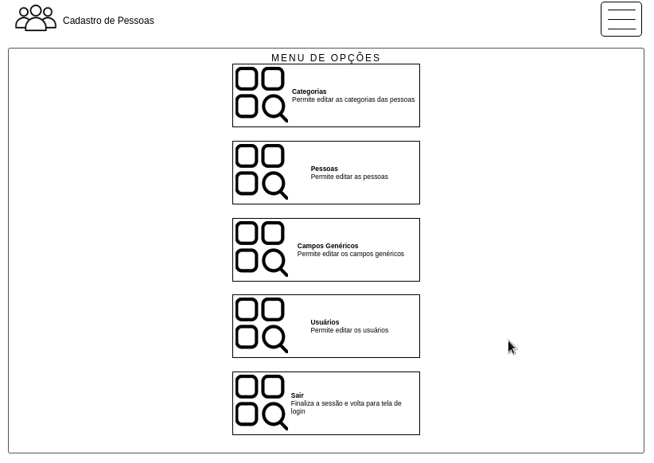 
Figura X – Tela de opções

| Requisitos atendidos | Cópia do Requisito |
| --- | --- |
| RF-01 | BLA BLA BLA |
| RF-02 | BLA BLA BLA | 

Artefatos específicos:
 - Opcoes.php

### 7.4 Categorias :: Listagem

Permite listar a categorias já cadastradas, com opção de busca, e acesso às ferramentas de edição e inserção de uma nova categoria.

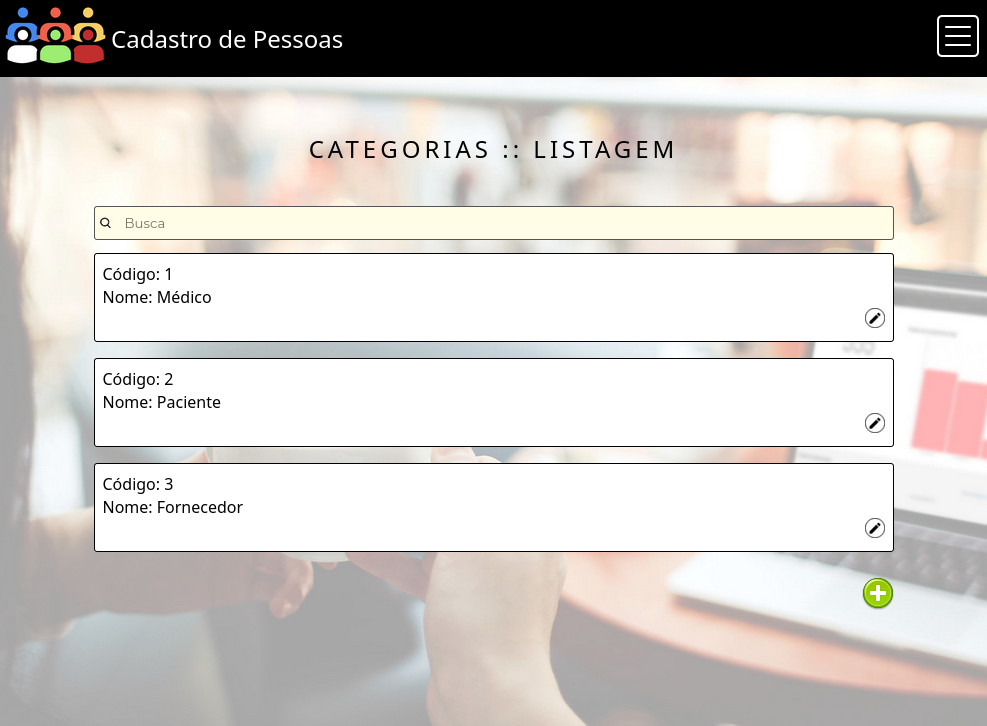 
Figura X – Tela de opções

| Requisitos atendidos | Cópia do Requisito |
| --- | --- |
| RF-01 | BLA BLA BLA |
| RF-02 | BLA BLA BLA |

Artefatos específicos:
 - Categorias_Listar.php

### 7.5 Categorias :: Inserção

Permite inserir uma nova categoria.

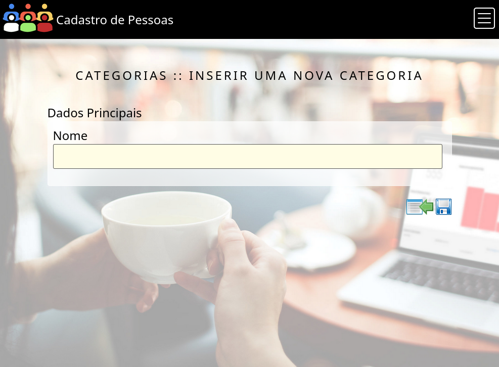 
Figura X – Tela de opções

| Requisitos atendidos | Cópia do Requisito |
| --- | --- |
| RF-01 | BLA BLA BLA |
| RF-02 | BLA BLA BLA |

Artefatos específicos:
 - Categorias_Inserir.php

### 7.6 Categorias :: Edição

Permite editar uma categoria já cadastrada, com opção de exclusão.

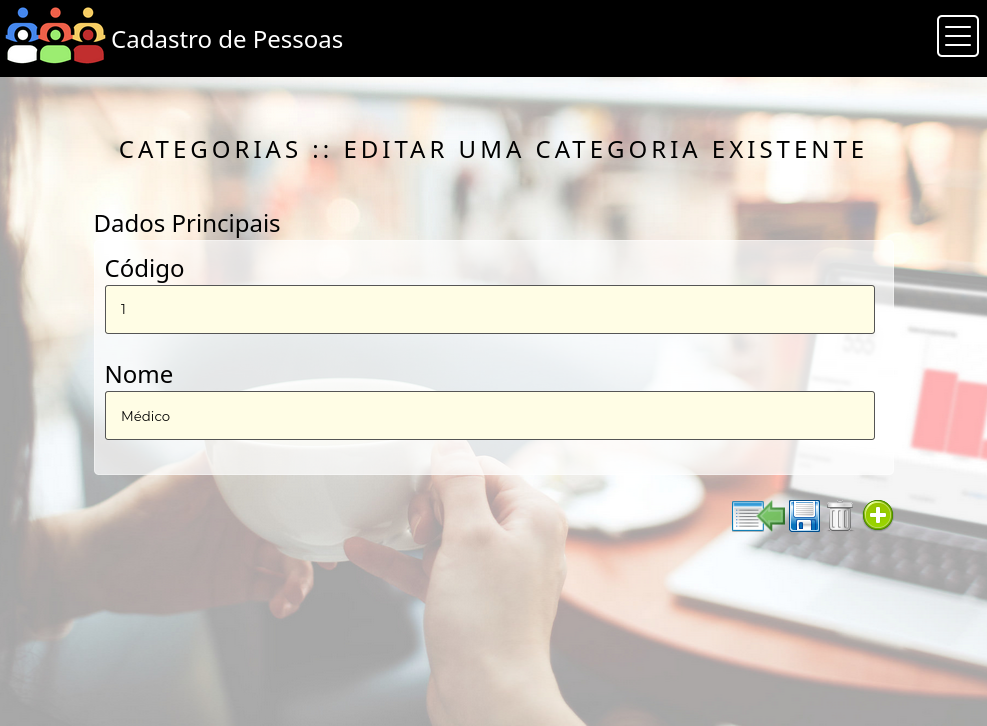 
Figura X – Tela de opções

| Requisitos atendidos | Cópia do Requisito |
| --- | --- |
| RF-01 | BLA BLA BLA |
| RF-02 | BLA BLA BLA |

Artefatos específicos:
 - Categorias_Editar.php

### 7.4 Pessoas :: Listagem

Permite listar a pessoass já cadastradas, com opção de busca, e acesso às ferramentas de edição e inserção de uma nova pessoa.

[TELA_RECUPERAR_SENHA.png]

| Requisitos atendidos | Cópia do Requisito |
| --- | --- |
| RF-01 | BLA BLA BLA |
| RF-02 | BLA BLA BLA |

### 7.5 Pessoas :: Inserção

Permite inserir uma nova pessoa.

 
Figura X – Tela de opções

| Requisitos atendidos | Cópia do Requisito |
| --- | --- |
| RF-01 | BLA BLA BLA |
| RF-02 | BLA BLA BLA |

Artefatos específicos:
 - Pessoas_Inserir.php

### 7.6 Pessoas :: Edição

Permite editar uma pessoa já cadastrada, com opção de exclusão.

[TELA_RECUPERAR_SENHA.png]

| Requisitos atendidos | Cópia do Requisito |
| --- | --- |
| RF-01 | BLA BLA BLA |
| RF-02 | BLA BLA BLA |

Artefatos específicos:
 - Pessoas_Editar.php

### 7.4 Cadastro Genérico :: Listagem

Permite listar os campos genéricos já cadastrados, com opção de busca, e acesso às ferramentas de edição e inserção de um novo campo genérico.

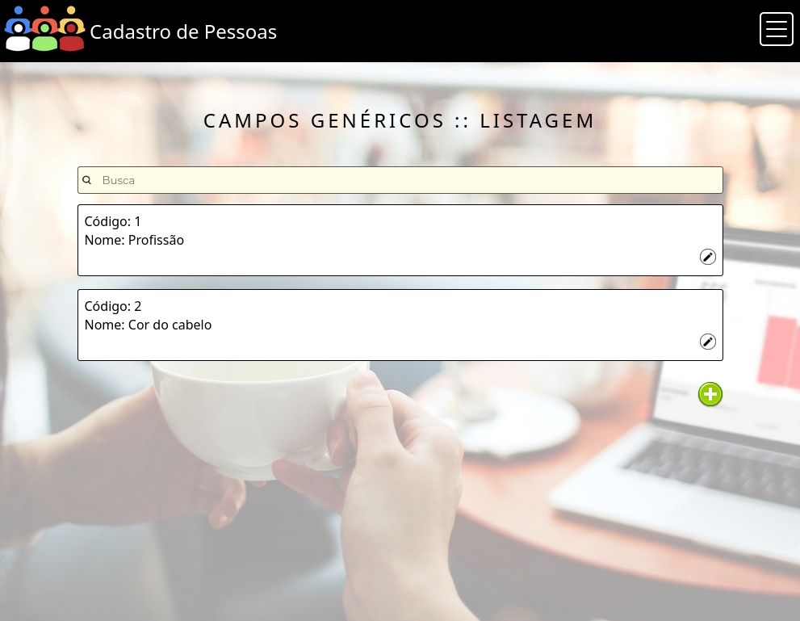 
Figura X – Tela de opções

| Requisitos atendidos | Cópia do Requisito |
| --- | --- |
| RF-01 | BLA BLA BLA |
| RF-02 | BLA BLA BLA |

Artefatos específicos:
 - Campos_Genericos_Listar.php

### 7.5 Cadastro Genérico :: Inserção

Permite inserir um novo campo genérico.

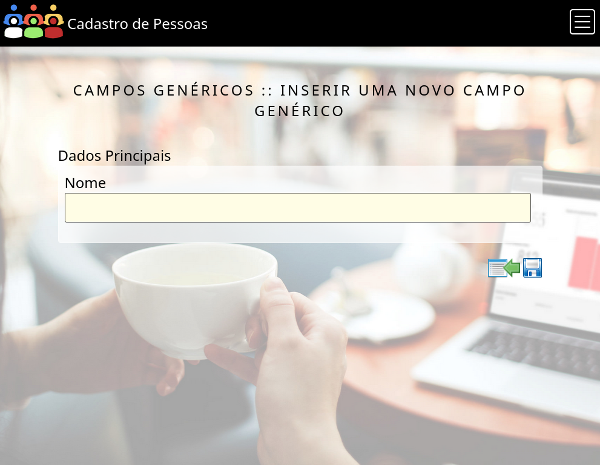 
Figura X – Tela de opções

| Requisitos atendidos | Cópia do Requisito |
| --- | --- |
| RF-01 | BLA BLA BLA |
| RF-02 | BLA BLA BLA |

Artefatos específicos:
 - Campos_Genericos_Inserir.php

### 7.6 Cadastro Genérico :: Edição

Permite editar um campo genérico já cadastrado, com opção de exclusão.

 
Figura X – Tela de opções

| Requisitos atendidos | Cópia do Requisito |
| --- | --- |
| RF-8 | O sistema deverá cadastrar usuários, e utilizar estes usuários para autenticação do sistema |
| RNF-4 | O sistema não poderá funcionar sem acesso autorizado. |

Artefatos específicos:
 - Campos_Genericos_Editar.php

### 7.4 Usuários :: Listagem

Permite listar os usuários já cadastrados, com opção de busca, e acesso às ferramentas de edição e inserção de uma novo usuário.

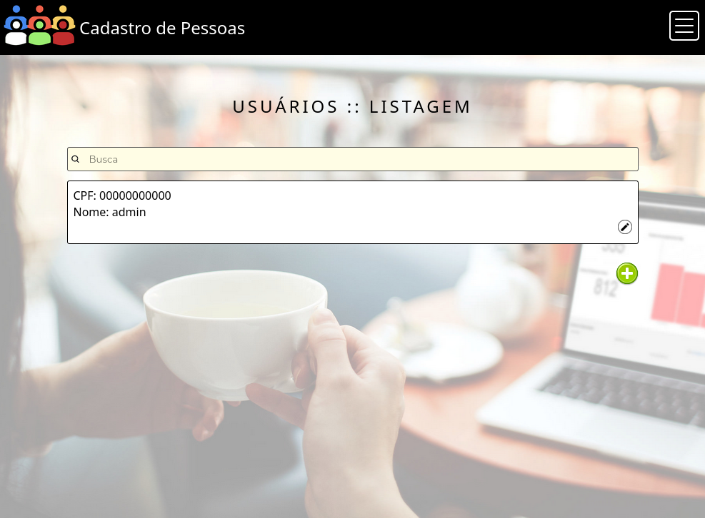 
Figura X – Tela de opções

| Requisitos atendidos | Cópia do Requisito |
| --- | --- |
| RF-01 | BLA BLA BLA |
| RF-02 | BLA BLA BLA |

Artefatos específicos:
 - Usuarios_Listar.php

### 7.5 Usuários :: Inserção

Permite listar os usuários já cadastrados, com opção de busca, e acesso às ferramentas de edição e inserção de uma novo usuário.

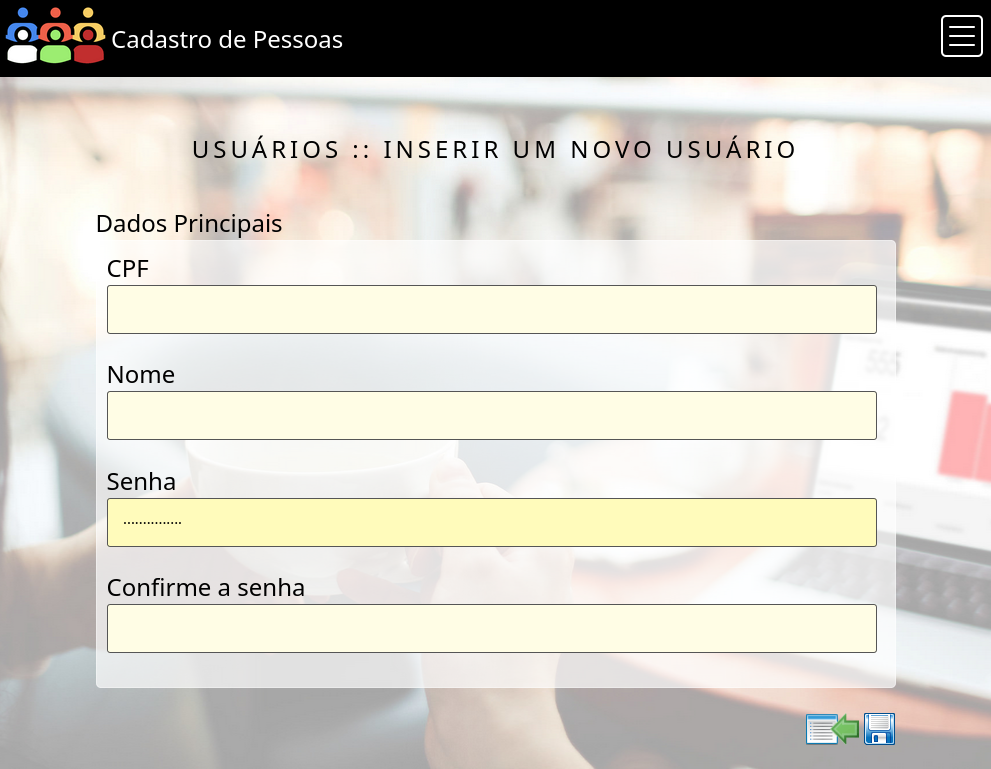 
Figura X – Tela de opções

| Requisitos atendidos | Cópia do Requisito |
| --- | --- |
| RF-01 | BLA BLA BLA |
| RF-02 | BLA BLA BLA |

Artefatos específicos:
 - Usuarios_Inserir.php

### 7.6 Usuários :: Edição

Permite editar um usuário já cadastrado, com opção de exclusão.

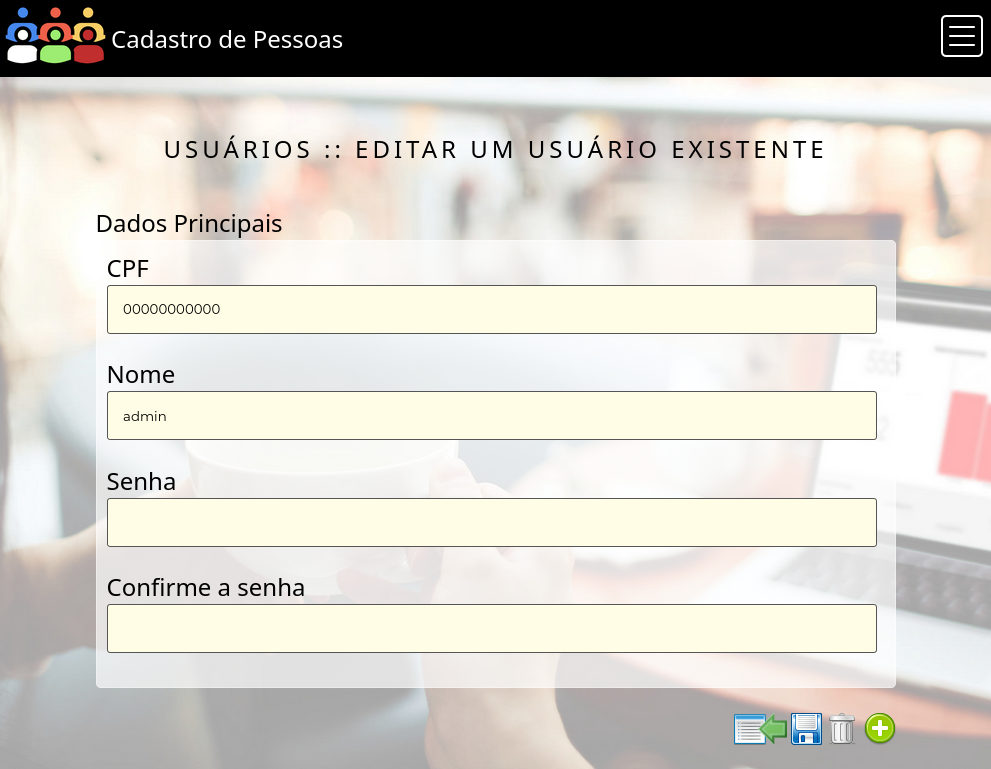 
Figura X – Tela de opções

| Requisitos atendidos | Cópia do Requisito |
| --- | --- |
| RF-01 | BLA BLA BLA |
| RF-02 | BLA BLA BLA |

Artefatos específicos:
 - Usuarios_Editar.php

