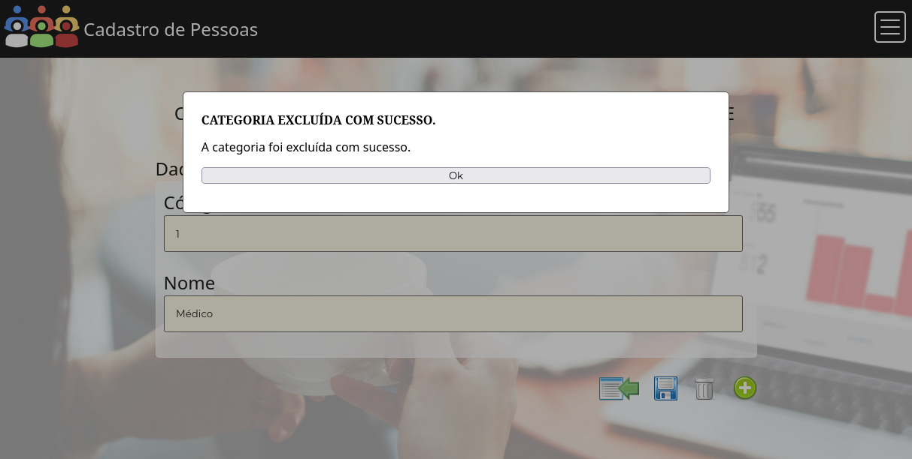

# 8. Registro de Testes do Software

Os cenários de testes apresentados demonstram se os requisitos foram satisfeitos.

## CT-1 - Entrada no sistema sem usuário previamente cadastrado
- Resultado obtido: Passou no teste
- Testado por: Bárbara

 
Figura 47 - Resultado do teste CT-1

## CT-2 - Recuperação de senha de um usuário cadastrado anteriormente
- Resultado obtido: Passou no teste
- Testado por: Andrey

 
Figura 48 - Resultado do teste CT-2

## CT-3 - Usuários não cadastrados não podem se autenticar no sistema
- Resultado obtido: Passou no teste
- Testado por: Leonardo Santos

 
Figura 49 - Resultado do teste CT-3

    
## CT-4 - Apenas usuários cadastrados podem se autenticar no sistema
- Resultado obtido: Passou no teste
- Testado por: Leonardo Ferreira

 
Figura 50 - Resultado do teste CT-4.1 
 
    Figura 51 - Resultado do teste CT-4.2

## CT-5 - Cadastro de categorias - Inclusão
- Resultado obtido: Passou no teste
- Testado por: Evellyn

 
    Figura 52 - Resultado do teste CT-5

## CT-6 - Cadastro de categorias - Edição
- Resultado obtido: Passou no teste
- Testado por: Andrey

 
    Figura 53 - Resultado do teste CT-6

## CT-7 - Cadastro de categorias - Exclusão
- Resultado obtido: Passou no teste
- Testado por: Bárbara

 
    Figura 54 - Resultado do teste CT-7

## CT-8 - Campos adicionais - Inclusão
- Resultado obtido: Passou no teste
- Testado por: Thiago

 
    Figura 55 - Resultado do teste CT-8

    
## CT-9 - Campos adicionais - Edição
- Resultado obtido: Passou no teste
- Testado por: Leonardo Santos

 
    Figura 56 - Resultado do teste CT-9

## CT-10 - Campos adicionais - Exclusão
- Resultado obtido: Passou no teste
- Testado por: Leonardo Ferreira     

 
Figura 57 - Resultado do teste CT-10

## CT-11 - Pessoas - Inclusão
- Resultado obtido: Passou no teste
- Testado por: Evellyn

 
Figura 58 - Resultado do teste CT-11 

 
## CT-12 - Pessoas - Edição
- Resultado obtido: Passou no teste
- Testado por: Andrey

 
Figura 59 - Resultado do teste CT-12  

## CT-13 - Pessoas - Excluir
- Resultado obtido: Passou no teste
- Testado por: Thiago

 
Figura 60 - Resultado do teste CT-13  

## CT-14 - Busca de pessoas por campos genéricos ou categorias
- Resultado obtido: Passou no teste
- Testado por: Bárbara

 
Figura 61 - Resultado do teste CT-14

## CT-15 - Exportação para excel
- Resultado obtido: Passou no teste
- Testado por: Evellyn

 
Figura 62 - Resultado do teste CT-15.1   
 
    Figura 63 - Resultado do teste CT-15.2

## CT-16 - Entrada de Dados com caracteres especiais
- Resultado obtido: Passou no teste
- Testado por: Evellyn

 
Figura 64 - Resultado do teste CT-16

## CT-17 - Pessoas com cpf/cnpj repetido na tela de edição
- Resultado obtido: Não passou no teste
- Testado por: Leonardo Ferreira

 
Figura 65 - Resultado do teste CT-17.1     
 
    Figura 66 - Resultado do teste CT-17.2

